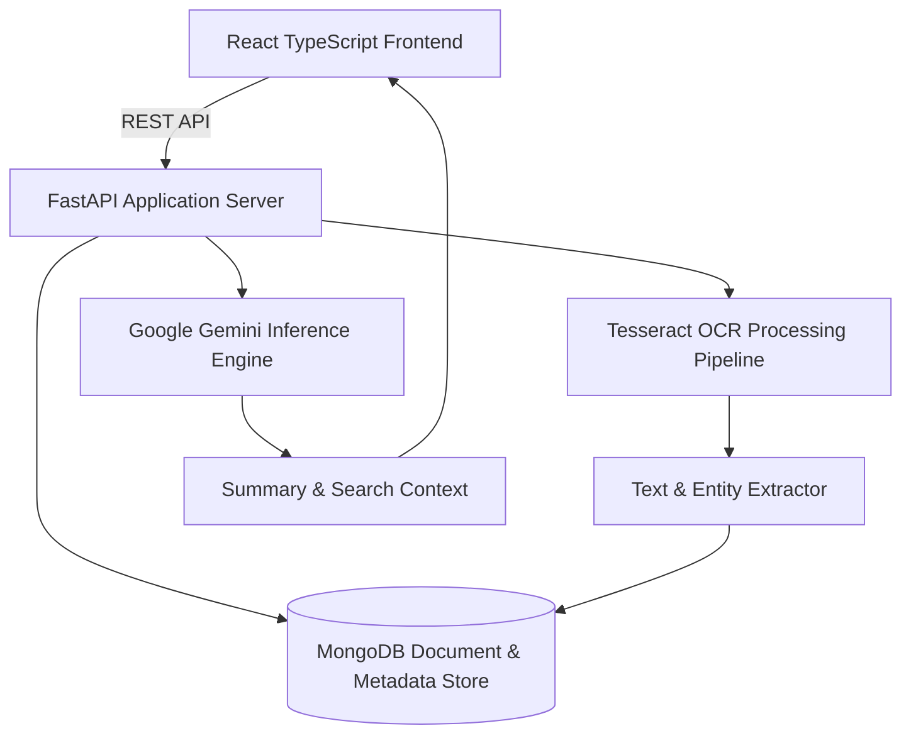

# CogniNote: Semantic Knowledge & Multimodal OCR Notes Engine

Fullstack AI-assisted knowledge management and document extraction engine featuring automated image OCR pipelines, vector semantic search, and document tagging.



## Architectural Overview

CogniNote combines document digitization with generative synthesis. When a user uploads handwritten notes, diagrams, or printed documents, the backend routes the media through a preprocessing pipeline before executing OCR extraction. Extracted textual contents are indexed in MongoDB alongside structural metadata, enabling instant keyword and semantic queries across notebooks.

### System Components

- **FastAPI Core (`backend/main.py`)**: Asynchronous REST endpoints managing note lifecycle, image uploads, search queries, and AI prompt synthesis.
- **OCR Ingestion Pipeline**: Integrates Tesseract OCR with adaptive image binarization for clean character extraction from varied paper contrasts.
- **Document Store**: MongoDB document collections indexing note titles, OCR output, tags, timestamps, and hierarchical folder associations.
- **Frontend SPA (`frontend/`)**: Modern React TypeScript user interface with real-time markdown preview, responsive sidebar navigation, and search filtering.

## Technology Stack

- **Backend**: Python 3.11+, FastAPI, Uvicorn, Motor / PyMongo, PyTesseract, Google Generative AI SDK
- **Frontend**: React 18, TypeScript, Vite, Tailwind CSS, Lucide Icons
- **Database**: MongoDB 6.0+

## Local Setup

### Backend Setup

```bash
cd backend
python -m venv venv
source venv/bin/activate  # On Windows: venv\Scripts\activate
pip install -r requirements.txt
cp .env.example .env     # Configure GOOGLE_API_KEY and MONGO_URI
uvicorn main:app --reload --port 8000
```

### Frontend Setup

```bash
cd frontend
npm install
npm run dev
```
